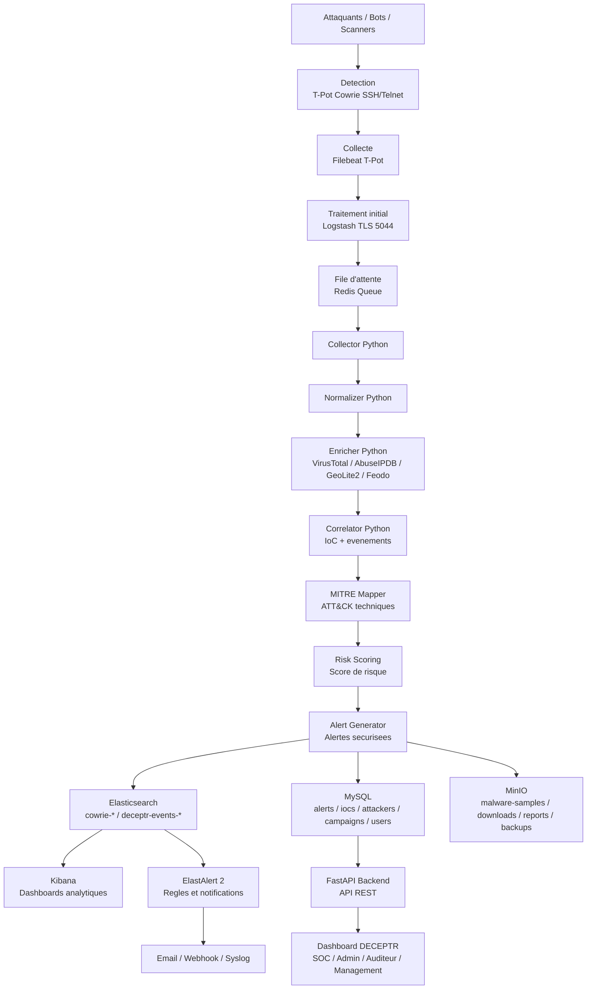

# Architecture Fonctionnelle - DECEPTR v1 MVP

## Objectif

Cette vue montre les fonctions du systeme DECEPTR, depuis la detection des activites dans le honeypot jusqu'a la visualisation, les alertes et les services API.

## Schema fonctionnel

## Couches fonctionnelles

| Couche | Role | Services du projet |
|---|---|---|
| 1. Detection | Capturer les connexions SSH/Telnet et commandes attaquants | `cowrie` |
| 2. Collecte | Lire les logs Cowrie JSON et les envoyer securises | `deceptr-tpot-forwarder` |
| 3. Traitement | Parser, normaliser et mettre en file d'attente | `deceptr-logstash`, `deceptr-redis` |
| 4. Renseignement | Enrichir IP/IoC avec sources externes | pipeline Python |
| 5. Correlation | Lier evenements, IoC, campagnes, MITRE ATT&CK | pipeline Python |
| 6. Stockage | Garder logs, alertes, objets et donnees metier | Elasticsearch, MySQL, MinIO |
| 7. Visualisation | Exploiter les donnees via dashboard et Kibana | `deceptr-dashboard`, `deceptr-kibana` |
| 8. Alertes | Generer et notifier les alertes | `deceptr-elastalert`, pipeline alerter |
| 9. Services | Exposer l'API et l'authentification | `deceptr-api` |

## Flux de donnees

| ID | Flux | Description |
|---|---|---|
| F1 | Cowrie -> Filebeat | Connexions, identifiants, commandes, fichiers et sessions en JSON |
| F2 | Filebeat -> Logstash | Transmission TLS 1.3 vers `TCP/5044` |
| F3 | Logstash -> Redis | Evenements parses envoyes dans la queue |
| F4 | Redis -> Pipeline | Le collector consomme les evenements |
| F5 | Pipeline -> Sources TI | Requetes VirusTotal, AbuseIPDB, GeoLite2, Feodo |
| F6 | Pipeline -> Stockage | Ecriture dans Elasticsearch, MySQL et MinIO |
| F7 | Stockage -> Dashboards | Kibana, FastAPI et dashboard DECEPTR affichent les donnees |
| F8 | Detection -> Notifications | ElastAlert et alerter envoient les notifications |

## Acteurs

| Acteur | Utilisation |
|---|---|
| SOC Analyst | Surveiller les alertes et investiguer les IoC |
| Administrateur | Gerer les services, utilisateurs et configuration |
| Auditeur | Consulter preuves, rapports et historique |
| Management | Lire les indicateurs et rapports synthetiques |

