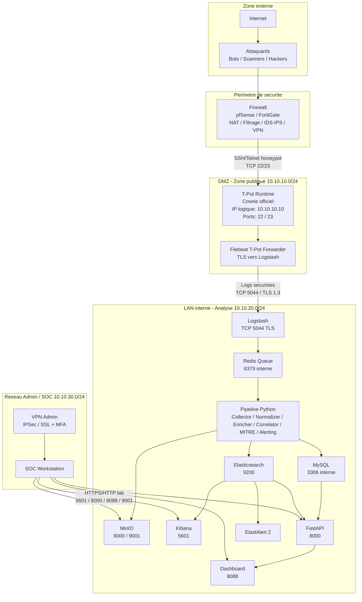

# Architecture Reseau - DECEPTR v1 MVP

## Objectif

Cette vue montre les zones reseau, les ports exposes et les flux autorises. Les flux sont unidirectionnels autant que possible: Internet vers honeypot, puis honeypot vers analyse interne.

## Schema reseau

## Ports reseau

| ID | Source | Destination | Port | Protocole | Role |
|---|---|---|---|---|---|
| R1 | Internet | T-Pot Cowrie | 22 | TCP | Honeypot SSH |
| R2 | Internet | T-Pot Cowrie | 23 | TCP | Honeypot Telnet |
| R3 | Filebeat T-Pot | DECEPTR Logstash | 5044 | TCP/TLS 1.3 | Envoi securise des logs |
| R4 | Logstash | Redis | 6379 | TCP interne | Queue d'evenements |
| R5 | Pipeline/API/Kibana | Elasticsearch | 9200 | HTTP interne | Logs et evenements |
| R6 | Pipeline/API | MySQL | 3306 | TCP interne | Donnees metier |
| R7 | Pipeline/API | MinIO | 9000 | HTTP/S3 interne | Objets, rapports, fichiers |
| R8 | Admin/SOC | Kibana | 5601 | HTTP lab / HTTPS prod | Dashboards analytiques |
| R9 | Admin/SOC | FastAPI | 8000 | HTTP lab / HTTPS prod | API REST |
| R10 | Admin/SOC | Dashboard | 8088 | HTTP lab / HTTPS prod | Dashboard SOC |
| R11 | Admin/SOC | MinIO Console | 9001 | HTTP lab / HTTPS prod | Console objets |

## Regles de securite

| Regle | Decision |
|---|---|
| Internet ne doit acceder qu'a Cowrie | Autoriser uniquement `TCP/22` et `TCP/23` vers la DMZ |
| T-Pot vers DECEPTR | Autoriser uniquement `TCP/5044` vers Logstash |
| Services internes | Ne pas exposer Redis/MySQL directement a Internet |
| Administration | Passer par VPN/MFA en production |
| TLS | Garder TLS 1.3 entre Filebeat et Logstash |

## Correspondance Docker actuelle

| Zone logique | Conteneurs |
|---|---|
| DMZ T-Pot | `cowrie`, `deceptr-tpot-forwarder` |
| Analyse interne | `deceptr-logstash`, `deceptr-redis`, `deceptr-pipeline`, `deceptr-elasticsearch`, `deceptr-mysql`, `deceptr-minio` |
| Visualisation/API | `deceptr-kibana`, `deceptr-api`, `deceptr-dashboard`, `deceptr-elastalert` |

