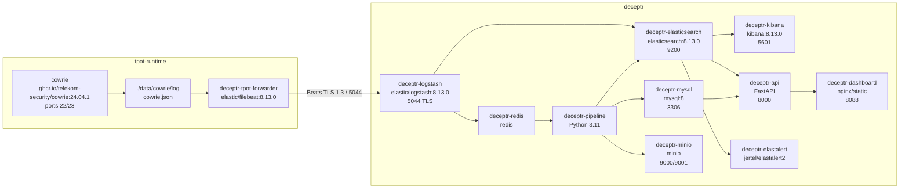

# Architecture Technique - DECEPTR v1 MVP

## Objectif

Cette vue detaille les composants techniques deployes dans Docker, leurs images, volumes, ports et responsabilites.

## Schema technique Docker



## Services techniques

| Service | Image / technologie | Port | Role |
|---|---|---|---|
| `cowrie` | `ghcr.io/telekom-security/cowrie:24.04.1` | 22, 23 | Honeypot SSH/Telnet officiel T-Pot |
| `deceptr-tpot-forwarder` | `elastic/filebeat:8.13.0` | aucun public | Envoie `cowrie.json` vers Logstash en TLS |
| `deceptr-logstash` | `logstash:8.13.0` | 5044 | Ingestion Beats TLS, parsing, routage |
| `deceptr-redis` | Redis | 6379 | Queue d'evenements |
| `deceptr-pipeline` | Python 3.11 | aucun public | Traitement, enrichissement, detection |
| `deceptr-elasticsearch` | `elasticsearch:8.13.0` | 9200 | Stockage logs et evenements |
| `deceptr-mysql` | MySQL 8 | 3306 interne | Stockage metier |
| `deceptr-minio` | MinIO | 9000, 9001 | Stockage objets |
| `deceptr-kibana` | `kibana:8.13.0` | 5601 | Dashboards Elasticsearch |
| `deceptr-api` | FastAPI | 8000 | API REST, auth, donnees dashboard |
| `deceptr-dashboard` | Nginx statique | 8088 | Interface DECEPTR |
| `deceptr-elastalert` | `jertel/elastalert2` | aucun public | Alertes basees sur Elasticsearch |

## Indices et tables

| Stockage | Nom | Contenu |
|---|---|---|
| Elasticsearch | `cowrie-YYYY.MM` | Logs bruts Cowrie apres Logstash |
| Elasticsearch | `deceptr-events-YYYY.MM` | Evenements normalises/enrichis |
| MySQL | `alerts` | Alertes generees |
| MySQL | `iocs` | Indicateurs de compromission |
| MySQL | `attackers` | Profils attaquants |
| MySQL | `campaigns` | Campagnes correlees |
| MySQL | `users` | Utilisateurs et roles |
| MinIO | `malware-samples` | Fichiers suspects |
| MinIO | `downloads` | Telechargements honeypot |
| MinIO | `reports` | Rapports |
| MinIO | `backups` | Sauvegardes |

## Fichiers importants

| Fichier | Role |
|---|---|
| `start.ps1` | Lance toute l'architecture finale |
| `stop.ps1` | Arrete les services sans supprimer les donnees |
| `tpot-runtime/docker-compose.yml` | Runtime Cowrie T-Pot + Filebeat |
| `deceptr/docker-compose.yml` | Stack DECEPTR principale |
| `deceptr/docker-compose.tpot.yml` | Desactive Cowrie/Filebeat locaux pour utiliser T-Pot |
| `deceptr/tpot/filebeat/tpot-cowrie-to-deceptr.yml` | Configuration Filebeat T-Pot vers Logstash |
| `deceptr/elk/logstash/pipeline/cowrie.conf` | Pipeline Logstash |
| `deceptr/pipeline/*.py` | Traitement Python |
| `deceptr/mysql/schema.sql` | Schema MySQL |
| `deceptr/dashboard/index.html` | Interface dashboard |

## Commandes d'exploitation

Demarrer:

```powershell
cd D:\assir\Ismagi\PFA\DECEPTR-FINAL
powershell -ExecutionPolicy Bypass -File .\start.ps1
```

Arreter:

```powershell
cd D:\assir\Ismagi\PFA\DECEPTR-FINAL
powershell -ExecutionPolicy Bypass -File .\stop.ps1
```

Verifier:

```powershell
docker ps --format "table {{.Names}}\t{{.Status}}\t{{.Ports}}"
docker exec deceptr-tpot-forwarder filebeat test output -e --strict.perms=false
```

URLs:

| Interface | URL |
|---|---|
| Dashboard DECEPTR | `http://127.0.0.1:8088/index.html?v=3` |
| Kibana | `http://127.0.0.1:5601` |
| API docs | `http://127.0.0.1:8000/docs` |
| MinIO console | `http://127.0.0.1:9001` |

